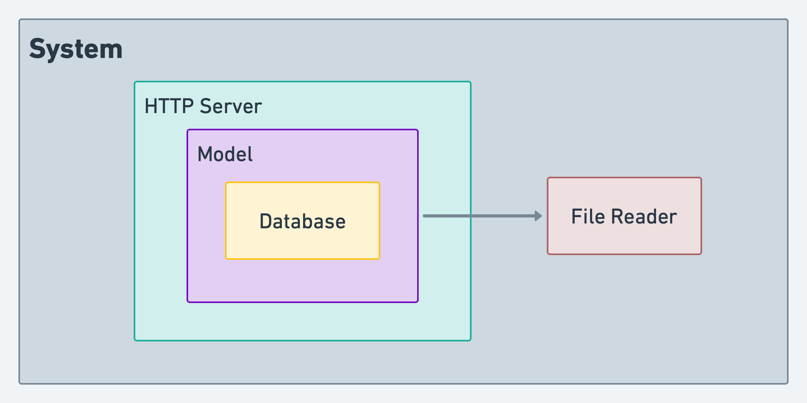

# whereabout
A service that imports CSV data and exposes it via an API.

The CSV file (`data_dump.csv`) that contains raw geolocation data. The goal is to develop
a service that imports such data and expose it via an API.


## Installation

The code is written assuming it will run on:
```
Leiningen 2.9.8 on Java 18.0.1.1 OpenJDK 64-Bit Server VM
```

This requires the following to be installed:
- [Leiningen](https://formulae.brew.sh/formula/leiningen)
  - On Mac, `brew install leiningen`
- [Java 17+](https://www.oracle.com/java/technologies/javase/jdk17-archive-downloads.html)
  - On Mac, `brew install java`

## Compilation

Run tests
```
lein do clean, test
```

To compile:
```
lein uberjar
```

To run, there are three environment settings:
- `PORT` signifies the port on which the server will start, default `8081`
- `DB` signifies the database storage file (SQLite), default `whereabout.sqlite3`
- `DATA_FILE` signifies the locaton of the input file, default `resources/data_dump.csv`
```
PORT=8888 DB=/tmp/whereaboutdb.sqlite3 DATA_FILE=/tmp/sample_data.csv java -jar target/whereabout-0.1.0-SNAPSHOT-standalone.jar
```

## System Design
The system is made of components that rely some other components:


- The HTTP Server depends on the database
- The model depends on the file reader and uses the database to insert rows 


The database used is SQLite.

## Sample curl commands

The following shows the response and headers for the happy path:

```
curl -D - -X GET "localhost:8082/location?ip=162.142.20.215"
HTTP/1.1 200 OK
Date: Wed, 30 Nov 2022 18:31:39 GMT
Content-Type: application/json
Set-Cookie: ring-session=5c291bfb-d876-4879-8472-11f963a180b0;Path=/;HttpOnly;SameSite=Strict
X-Frame-Options: SAMEORIGIN
X-Content-Type-Options: nosniff
Transfer-Encoding: chunked
Server: Jetty(9.4.48.v20220622)

{"result":{"city":"East Mafaldahaven","country":"French Polynesia"}}
```


A similar unhappy path:
```
curl -D - -X GET "localhost:8082/location?ip=1234"
HTTP/1.1 404 Not Found
Date: Wed, 30 Nov 2022 18:32:56 GMT
Content-Type: application/json
Set-Cookie: ring-session=50b60a29-f225-4455-9d34-e8aefe3f310c;Path=/;HttpOnly;SameSite=Strict
X-Frame-Options: SAMEORIGIN
X-Content-Type-Options: nosniff
Transfer-Encoding: chunked
Server: Jetty(9.4.48.v20220622)

{"error":"Could not find a location"}
```

## License

Copyright © 2022 FIXME

This program and the accompanying materials are made available under the
terms of the Eclipse Public License 2.0 which is available at
http://www.eclipse.org/legal/epl-2.0.

This Source Code may also be made available under the following Secondary
Licenses when the conditions for such availability set forth in the Eclipse
Public License, v. 2.0 are satisfied: GNU General Public License as published by
the Free Software Foundation, either version 2 of the License, or (at your
option) any later version, with the GNU Classpath Exception which is available
at https://www.gnu.org/software/classpath/license.html.
